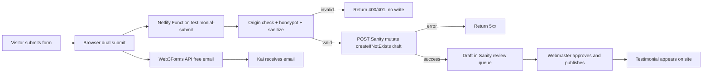

# Testimonial Automation — Web3Forms to Sanity

This document describes the automation that connects the testimonials form on [`testimonials.html`](../testimonials.html) to Sanity CMS. When a visitor submits a testimonial, the automation creates a **draft** document in Sanity so the webmaster can review it before it appears on the site.

The **Sanity → webpage** path already works via [`js/testimonials.js`](../js/testimonials.js). This automation handles the missing **webpage form → Sanity** leg.

**Primary implementation (free):** dual submit from the browser — Web3Forms (free email) + Netlify Function (Sanity draft) in parallel via [`js/testimonials.js`](../js/testimonials.js). No paid Web3Forms plan required.

**Optional upgrade:** Web3Forms paid webhooks can also POST to the same function for server-to-server delivery.

---

## End-to-end flow



**Review model:** Submissions land as unpublished drafts with `approved: false`. The webmaster opens Sanity Studio, reviews the quote, sets **Approved** to `true`, and publishes. The site query only returns `approved == true` documents, so nothing auto-publishes.

---

## Quick start (free dual submit)

### 1. Deploy to Netlify

The repo includes [`netlify.toml`](../netlify.toml) configured to publish the static site from the repo root and deploy functions from `netlify/functions/`.

1. Connect this repo to [Netlify](https://www.netlify.com/).
2. Deploy — Netlify picks up `netlify.toml` automatically.
3. Note your site URL (e.g. `https://youniverse.netlify.app`).

### 2. Set environment variables

In Netlify: **Site settings → Environment variables**. Copy from [`.env.example`](../.env.example):

| Variable | Required | Value |
|----------|----------|-------|
| `SANITY_WRITE_TOKEN` | Yes | Editor token from [sanity.io/manage](https://sanity.io/manage) → project **janrh8g1** → API → Tokens |
| `ALLOWED_ORIGINS` | Yes (production) | Comma-separated site origins, e.g. `https://youniverse.netlify.app,http://localhost:8888` |
| `WEBHOOK_SECRET` | No | Only if using paid Web3Forms webhooks |
| `SANITY_PROJECT_ID` | No | Defaults to `janrh8g1` (matches [`js/config.js`](../js/config.js)) |
| `SANITY_DATASET` | No | Defaults to `production01` |
| `SANITY_API_VERSION` | No | Defaults to `2024-01-01` |

Redeploy after setting env vars so the function picks them up.

### 3. Test a submission

No Web3Forms webhook configuration is needed for the free path. On submit, [`js/testimonials.js`](../js/testimonials.js) fires two parallel requests:

1. **Web3Forms** — delivers email notification (free tier)
2. **`/api/testimonial-submit`** — creates Sanity draft (Netlify function)

Submit a test entry from [`testimonials.html`](../testimonials.html) on your deployed site.

### 4. Verify in Sanity Studio

1. Open Sanity Studio (`cd studio && npm run dev`, or your deployed Studio URL).
2. Check **Testimonials** — a new draft should appear with `approved: false` and `source: website`.
3. Set **Approved** to `true` and publish.
4. Confirm it appears on the Testimonials page.

### Optional: Web3Forms webhook (paid plan)

If you upgrade to Web3Forms Starter or higher, you can also configure a server-to-server webhook to the same endpoint:

1. Web3Forms dashboard → **Integrations → Webhooks** → toggle on
2. URL: `https://<your-netlify-site>/api/testimonial-submit`
3. Optional header: `X-Webhook-Secret: <value matching WEBHOOK_SECRET env var>`
4. Set `WEBHOOK_SECRET` in Netlify env vars

---

## The function

**File:** [`netlify/functions/testimonial-submit.mjs`](../netlify/functions/testimonial-submit.mjs)

**Route:** `POST /api/testimonial-submit`

### What it does

1. Rejects non-POST requests (405).
2. Authenticates the request via **either**:
   - **Browser mode (free):** `Origin`/`Referer` matches `ALLOWED_ORIGINS` and honeypot `botcheck` is not triggered
   - **Webhook mode (optional):** `X-Webhook-Secret` header matches `WEBHOOK_SECRET`
3. Parses JSON body; maps `name` → Sanity `name`, `message` → Sanity `quote`.
4. Sanitizes input: trims whitespace, strips control characters, enforces max lengths (name 100, quote 1000).
5. Validates both fields are non-empty (400 if missing).
6. Builds a deterministic document ID: `drafts.testimonial-web-<sha1(name|quote)[:16]>`.
7. POSTs a `createIfNotExists` mutation to the Sanity API with `approved: false`, `submittedAt`, and `source: "website"` (browser) or `"web3forms"` (webhook).
8. Returns 200 on success; 500/502 on Sanity failure.

### Field mapping

| Web3Forms field | Sanity field | Notes |
|-----------------|--------------|-------|
| `name` | `name` | Required, max 100 chars |
| `message` | `quote` | Required, max 1000 chars |
| — | `approved` | Always `false` |
| — | `submittedAt` | ISO timestamp, set by function |
| — | `source` | `"website"` (browser) or `"web3forms"` (webhook) |
| — | `service` | Left empty; webmaster fills in Studio |

### Sanity API request

| Property | Value |
|----------|-------|
| **Endpoint** | `POST https://janrh8g1.api.sanity.io/v2024-01-01/data/mutate/production01` |
| **Authorization** | `Bearer <SANITY_WRITE_TOKEN>` |
| **Content-Type** | `application/json` |

Example mutation body:

```json
{
  "mutations": [
    {
      "createIfNotExists": {
        "_id": "drafts.testimonial-web-a3f8c2e1b9d0476e",
        "_type": "testimonial",
        "name": "Jane Doe",
        "quote": "Kai's reading gave me real clarity.",
        "approved": false,
        "submittedAt": "2026-07-15T22:00:00.000Z",
        "source": "web3forms"
      }
    }
  ]
}
```

The `drafts.` prefix keeps the document unpublished until the webmaster explicitly publishes it in Studio.

---

## Local testing

### Prerequisites

Install the Netlify CLI (one-time):

```sh
npm install -g netlify-cli
```

Copy env vars:

```sh
cp .env.example .env
# Edit .env with SANITY_WRITE_TOKEN and ALLOWED_ORIGINS
```

### Run locally

```sh
netlify dev
```

The function is available at `http://localhost:8888/api/testimonial-submit`.

The site and function are both served at `http://localhost:8888`. Open `http://localhost:8888/testimonials.html` and submit the form to test the full dual-submit flow.

### Test with curl (browser auth mode)

```sh
curl -X POST http://localhost:8888/api/testimonial-submit \
  -H "Content-Type: application/json" \
  -H "Origin: http://localhost:8888" \
  -d '{
    "name": "Test User",
    "message": "This is a test testimonial from curl.",
    "botcheck": false
  }'
```

### Test with curl (webhook auth mode, optional)

```sh
curl -X POST http://localhost:8888/api/testimonial-submit \
  -H "Content-Type: application/json" \
  -H "X-Webhook-Secret: your-webhook-secret-here" \
  -d '{
    "name": "Test User",
    "message": "This is a test testimonial from curl."
  }'
```

Expected response on success:

```json
{
  "success": true,
  "documentId": "drafts.testimonial-web-<hash>",
  "result": { "transactionId": "...", "results": [...] }
}
```

### Test rejection cases

```sh
# Missing origin and secret -> 401
curl -X POST http://localhost:8888/api/testimonial-submit \
  -H "Content-Type: application/json" \
  -d '{"name": "Test", "message": "Quote", "botcheck": false}'

# Honeypot triggered -> 401
curl -X POST http://localhost:8888/api/testimonial-submit \
  -H "Content-Type: application/json" \
  -H "Origin: http://localhost:8888" \
  -d '{"name": "Test", "message": "Quote", "botcheck": true}'

# Empty message -> 400
curl -X POST http://localhost:8888/api/testimonial-submit \
  -H "Content-Type: application/json" \
  -H "Origin: http://localhost:8888" \
  -d '{"name": "Test", "message": "", "botcheck": false}'
```

---

## Authentication

### Inbound — browser → function (free path)

The form in [`js/testimonials.js`](../js/testimonials.js) POSTs JSON to `/api/testimonial-submit` on the same origin. The function verifies:

| Check | How |
|-------|-----|
| **Allowed origin** | `Origin` or `Referer` header must match a value in `ALLOWED_ORIGINS` |
| **Honeypot** | `botcheck` must not be `true`, `"on"`, or `"1"` |
| **HTTPS** | Enforced in production via Netlify |

Default allowed origins (if `ALLOWED_ORIGINS` is unset): `http://localhost:8888`, `http://localhost:8765`, `http://localhost:8080`.

**Before production deploy**, set `ALLOWED_ORIGINS` to include your live site URL, e.g. `https://youniverse.netlify.app,http://localhost:8888`.

No secret is embedded in client-side JavaScript.

### Inbound — Web3Forms webhook → function (optional, paid)

If using paid Web3Forms webhooks, authenticate with a shared secret header:

| Method | How |
|--------|-----|
| **Shared secret header** | `X-Webhook-Secret` in Web3Forms optional headers; verified against `WEBHOOK_SECRET` env var |
| **HTTPS only** | Web3Forms requires `https://` URLs (enforced) |

Generate the secret with `openssl rand -hex 32`. Store in Netlify as `WEBHOOK_SECRET`. Never commit to the repository.

Web3Forms does **not** support HMAC or cryptographic signatures on webhook payloads.

### Outbound — function → Sanity

| Property | Value |
|----------|-------|
| **Auth type** | Bearer token |
| **Required role** | **Editor** (read + write) |
| **Where to generate** | [sanity.io/manage](https://sanity.io/manage) → project **janrh8g1** → API → Tokens |
| **Storage** | Netlify env var `SANITY_WRITE_TOKEN` |

The token is shown only once at creation. See also [`docs/SANITY-SETUP.md`](SANITY-SETUP.md) for token guidance.

---

## Edge cases

### Duplicate submissions (idempotency)

Deterministic `_id` from `sha1(name|quote)` + `createIfNotExists` mutation means repeated deliveries (double-click or Web3Forms retry) do not create duplicate documents.

**Trade-off:** Two visitors submitting identical name + quote text de-duplicate to one document.

### Missing required fields

The function validates `name` and `message` independently (the webhook endpoint is public). Empty fields after sanitization return **400** with no Sanity write.

### Sanity API write failures

On Sanity non-2xx or network error, the function returns **500/502** and logs the payload to Netlify function logs. The form shows an error to the visitor (both Web3Forms and Sanity requests must succeed).

Check **Netlify → Functions → testimonial-submit → Logs** if submissions are not appearing in Sanity.

### Spam / honeypot

The website honeypot field (`botcheck`) is checked by both Web3Forms (email path) and the Netlify function (Sanity path). Bots that fill the honeypot are rejected from creating Sanity drafts.

---

## Webmaster review workflow

| Step | Before automation | After automation |
|------|-------------------|------------------|
| Submission arrives | Email only | Email + Sanity draft |
| Review | Copy from email into Sanity | Open draft in Studio |
| Approve | Create document, set approved, publish | Set approved, publish |
| Site update | Automatic after publish | Automatic after publish |

In Sanity Studio:

1. Open **Testimonials** — new submissions appear as drafts labeled "Pending approval".
2. Review the quote and name; optionally add a **Service** label.
3. Set **Approved** to `true`.
4. Click **Publish**.

---

## Testing checklist

1. Copy `.env.example` to `.env` and fill in `SANITY_WRITE_TOKEN` (and `ALLOWED_ORIGINS` if testing from a custom origin).
2. Run `netlify dev` and open `http://localhost:8888/testimonials.html`.
3. Submit a test entry — verify email arrives (Web3Forms) and draft appears in Sanity Studio with `approved: false` and `source: website`.
4. Deploy to Netlify; set `SANITY_WRITE_TOKEN` and `ALLOWED_ORIGINS` (include production URL) in the Netlify dashboard.
5. Submit a test entry on the live site.
6. Verify idempotency — submit the same name + quote again; no duplicate document.
7. Verify rejection — curl without `Origin` header returns 401.
8. Verify site gating — testimonial does not appear until approved and published.
9. Approve and publish; confirm it appears on the Testimonials page.

---

## Alternative: no-code platforms

If you prefer not to deploy a serverless function, the same logic can be built in a no-code automation platform. The Web3Forms webhook payload, Sanity API call, field mapping, and edge-case handling are identical.

### n8n (self-hosted)

| Platform | Fit | Notes |
|----------|-----|-------|
| **n8n** | Best no-code option | Free when self-hosted. `Webhook` + `Code` + `HTTP Request` nodes cover secret verification, sanitization, idempotency hashing, retries, and error alerting. |
| **Make** | Good alternative | No server; generous free ops tier. Hashing/dedup logic is clunkier. |
| **Zapier** | Weakest fit | Higher paid tiers for webhooks and code steps. Bills per task. |

#### n8n workflow structure

**Workflow A — Main:**

```
Webhook (POST)
  → Code (verify secret, validate, sanitize, build mutation)
  → IF (statusCode === 200)
      → true:  HTTP Request (Sanity mutate)
               → Respond to Webhook (200)
      → false: Respond to Webhook (400/401)
```

**Workflow B — Error handler:**

```
Error Trigger → Set (format error) → Send alert (email/Slack)
```

#### n8n Code node (reference)

```javascript
const crypto = require('crypto');

const WEBHOOK_SECRET = $env.WEBHOOK_SECRET;
const incomingSecret = $input.first().headers['x-webhook-secret'];

if (!incomingSecret || incomingSecret !== WEBHOOK_SECRET) {
  return [{ json: { error: 'Unauthorized', statusCode: 401 } }];
}

const body = $input.first().json.body || $input.first().json;

function sanitize(str, maxLen) {
  return String(str || '')
    .trim()
    .replace(/[\x00-\x1F\x7F]/g, '')
    .slice(0, maxLen);
}

const name = sanitize(body.name, 100);
const quote = sanitize(body.message, 1000);

if (!name || !quote) {
  return [{ json: { error: 'Missing required fields', statusCode: 400 } }];
}

const hash = crypto
  .createHash('sha1')
  .update(name + '|' + quote)
  .digest('hex')
  .slice(0, 16);

return [{
  json: {
    statusCode: 200,
    mutation: {
      mutations: [{
        createIfNotExists: {
          _id: 'drafts.testimonial-web-' + hash,
          _type: 'testimonial',
          name,
          quote,
          approved: false,
          submittedAt: new Date().toISOString(),
          source: 'web3forms',
        },
      }],
    },
  },
}];
```

#### Make.com (brief)

1. **Custom Webhook** module — copy URL into Web3Forms.
2. **Router** — branch on secret header match.
3. **HTTP module** — POST to Sanity mutate endpoint.
4. **Error route** — send notification on failure.

Make's free tier (1,000 ops/month) is sufficient for a low-volume testimonials form.

---

## Related docs

- [`docs/WEB3FORMS-SETUP.md`](WEB3FORMS-SETUP.md) — form configuration and access key
- [`docs/SANITY-SETUP.md`](SANITY-SETUP.md) — Sanity project, schema, and content management
- [`studio/schemaTypes/testimonial.ts`](../studio/schemaTypes/testimonial.ts) — testimonial document schema
- [`.env.example`](../.env.example) — environment variable template
