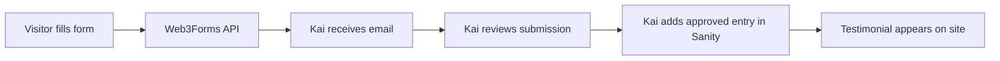

# Web3Forms Setup — Youniverse Testimonials

The testimonials submission form on [`testimonials.html`](../testimonials.html) uses [Web3Forms](https://web3forms.com) to deliver form entries to Kai's email. Approved testimonials are then added manually in Sanity CMS.

## Configuration values needed

| Value | Where to set it | Purpose |
|-------|-----------------|---------|
| **Access Key** | [`js/config.js`](../js/config.js) → `SITE_CONFIG.web3forms.accessKey` | Authenticates form submissions |
| **Recipient email** | Web3Forms dashboard (linked to access key) | Where submissions are delivered |

Optional redirect URLs can be added later in `SITE_CONFIG.web3forms` if Kai wants post-submit navigation.

---

## How to get your Access Key

1. Go to [web3forms.com](https://web3forms.com).
2. Enter the email address where you want to receive submissions.
3. Copy the **Access Key** provided.
4. Paste it into `js/config.js`:
   ```javascript
   web3forms: {
       accessKey: 'your-access-key-here',
       recipientEmail: 'kai@example.com',
   },
   ```

---

## Submission workflow



1. **Visitor** fills out Name + Testimonial on the Testimonials page.
2. **Form submits** to `https://api.web3forms.com/submit` via JavaScript ([`js/testimonials.js`](../js/testimonials.js)).
3. **Kai receives an email** with the submission details.
4. **Kai reviews** the content (moderation — nothing appears on site automatically).
5. **If approved**, Kai creates a Testimonial in Sanity with `approved: true`.
6. **Site displays** the testimonial on next page load.

This is intentional: user submissions never auto-publish.

---

## Managing submissions in the Web3Forms dashboard

1. Log in at [web3forms.com](https://web3forms.com) with the email used to create the access key.
2. View recent submissions, spam filters, and delivery logs.
3. Configure notification settings, auto-reply emails, or webhook integrations if needed later.

---

## Form fields sent to Web3Forms

| Field | HTML name | Notes |
|-------|-----------|-------|
| Name | `name` | Required, max 100 chars |
| Testimonial | `message` | Required, max 1000 chars |
| Subject | `subject` | Hidden: "New Youniverse Testimonial" |
| Access key | `access_key` | Added by JavaScript |
| Honeypot | `botcheck` | Hidden spam trap |

---

## Testing locally

1. Set a real access key in `js/config.js`.
2. Run `python3 -m http.server 8765`.
3. Open `http://localhost:8765/testimonials.html`.
4. Submit a test entry.
5. Check the configured email inbox (and Web3Forms dashboard) for delivery.

If the key is still `YOUR_WEB3FORMS_ACCESS_KEY`, the form shows: *"Form not yet configured."*

---

## Items requiring Kai's input

- [ ] Web3Forms Access Key
- [ ] Recipient email address
- [ ] Optional redirect URLs after submit (success/error pages)
- [ ] Confirm moderated workflow (recommended: keep current Sanity approval flow)
