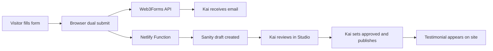

# Web3Forms Setup — Youniverse Testimonials

The testimonials submission form on [`testimonials.html`](../testimonials.html) uses [Web3Forms](https://web3forms.com) (free tier) for email notifications and a Netlify Function for Sanity draft creation. See [`docs/TESTIMONIAL-AUTOMATION.md`](TESTIMONIAL-AUTOMATION.md) for the full automation setup.

## Configuration values needed

| Value | Where to set it | Purpose |
|-------|-----------------|---------|
| **Access Key** | [`js/config.js`](../js/config.js) → `SITE_CONFIG.web3forms.accessKey` | Authenticates form submissions to Web3Forms |
| **Recipient email** | Web3Forms dashboard (linked to access key) | Where submissions are delivered |
| **Sanity write token** | Netlify env var `SANITY_WRITE_TOKEN` | Creates draft testimonials in Sanity |
| **Allowed origins** | Netlify env var `ALLOWED_ORIGINS` | Permits browser submissions to the Netlify function |

Optional redirect URLs can be added later in `SITE_CONFIG.web3forms` if Kai wants post-submit navigation.

---

## How to get your Access Key

1. Go to [web3forms.com](https://web3forms.com).
2. Enter the email address where you want to receive submissions.
3. Copy the **Access Key** provided.
4. Paste it into `js/config.js`:
   ```javascript
   web3forms: {
       accessKey: 'your-access-key-here',
       recipientEmail: 'kai@example.com',
   },
   ```

---

## Submission workflow



1. **Visitor** fills out Name + Testimonial on the Testimonials page.
2. **Form submits in parallel** via [`js/testimonials.js`](../js/testimonials.js):
   - Web3Forms API → email notification (free tier)
   - `/api/testimonial-submit` → Sanity draft (Netlify function)
3. **Kai receives an email** and finds a matching draft in Sanity Studio.
4. **Kai reviews** the content in Studio (moderation — nothing appears on site automatically).
5. **If approved**, Kai sets `approved: true` and publishes.
6. **Site displays** the testimonial on next page load.

This is intentional: user submissions never auto-publish.

**No paid Web3Forms plan is required.** Webhooks are optional; the browser posts directly to the Netlify function.

---

## Managing submissions in the Web3Forms dashboard

1. Log in at [web3forms.com](https://web3forms.com) with the email used to create the access key.
2. View recent submissions, spam filters, and delivery logs.
3. Configure notification settings or auto-reply emails as needed.

---

## Form fields

| Field | HTML name | Sent to Web3Forms | Sent to Netlify function |
|-------|-----------|-------------------|--------------------------|
| Name | `name` | Yes | Yes (`name`) |
| Testimonial | `message` | Yes | Yes (`message`) |
| Subject | `subject` | Yes | No |
| Access key | `access_key` | Yes (added by JS) | No |
| Honeypot | `botcheck` | Yes | Yes (`botcheck: false`) |

---

## Testing locally

Use `netlify dev` (not plain `python -m http.server`) so the Netlify function is available:

1. Set a real access key in `js/config.js`.
2. Copy `.env.example` to `.env` and fill in `SANITY_WRITE_TOKEN`.
3. Run `netlify dev`.
4. Open `http://localhost:8888/testimonials.html`.
5. Submit a test entry.
6. Check email inbox, Sanity Studio, and Netlify function logs.

If the key is still `YOUR_WEB3FORMS_ACCESS_KEY`, the form shows: *"Form not yet configured."*

---

## Items requiring Kai's input

- [ ] Web3Forms Access Key
- [ ] Recipient email address
- [ ] Sanity write token in Netlify env vars
- [ ] Production site URL in `ALLOWED_ORIGINS` env var
- [ ] Confirm moderated workflow (recommended: keep current Sanity approval flow)
